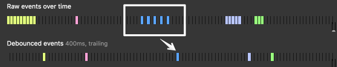

title: throttle与debounce的区别
date: 2016-04-09 15:46:14
categories:
tags:
---
以前写过一篇文章[《“节流函数”提高性能》](http://zhuxinyong.com/2016/01/03/%E2%80%9C%E8%8A%82%E6%B5%81%E5%87%BD%E6%95%B0%E2%80%9D%E6%8F%90%E9%AB%98%E6%80%A7%E8%83%BD/)，里面讲到用函数“节流”来减少执行次数（不影响体验的情况下），其实实现的代码并没有问题，但是第二个方法的函数名有问题。前几天看到一篇文章，我的公众号里也分享了《一次发现underscore源码bug的经历以及对学术界拿来主义的思考》具体文章详见，微信公众号：。

文中讲了大家对throttle和debounce存在误解，同时提到了《高程3》中实现节流方法存在一些问题，为了更好的理解这两个概念，搜了很多相关文章，详见文章底部。

throttle与debounce是两个类似的概念，目的都是随着时间的推移控制执行函数的次数，但是有些细微的差别。

当我们为DOM事件关联方法时，若我们有一个debounced和throttled函数将会很方便，为何？因为这样我们可以在事件和执行函数之间添加一层控制，注意我们并没有去控制DOM事件触发的次数。

例如，我们谈一下scroll事件，看下面的例子：

<p data-height="268" data-theme-id="0" data-slug-hash="xVpoOe" data-default-tab="result" data-user="ghostcode" class="codepen">See the Pen <a href="http://codepen.io/ghostcode/pen/xVpoOe/">Scroll events counter</a> by ghostcode (<a href="http://codepen.io/ghostcode">@ghostcode</a>) on <a href="http://codepen.io">CodePen</a>.</p>
<script async src="//assets.codepen.io/assets/embed/ei.js"></script>

当你在触控板或者鼠标滚动时，每次最少会达到30次，在手机上更多。可是你的滚动事件处理函数对这个频率是否应付的过来？

在2011年，Twitter网站曾爆出一个问题：当你在主页往下滚动时，页面会变得缓慢以致没有响应。John Resig发表了一篇文章[《 a blog post about the problem》](http://ejohn.org/blog/learning-from-twitter/)指出直接在scroll事件上面绑定高消耗的事件是一个多么愚蠢的想法。

在那个时候John建议使用一个独立于scroll事件且每250ms执行的轮询方法。这样的话处理方法就不会耦合于事件。通过这个简单的技术，我们可以提高用户体验。

现在有一些更先进的事件处理方法，让我来给你介绍：__Debounce，Throttle和requestAnimationFrame__，同时会介绍一些适用的场景。

__Debounce__

Debounce技术使我们可以将一个连续的调用归为一个。



想象你在电梯的场景，当电梯门开始要关闭的时候，突然一个人进来，此时电梯并不会关闭并且也不会执行改变楼层的方法，如果还有人进来同样的事情会发生：电梯延迟执行它的方法（改变楼层），优化了它的资源。

自己尝试一下，在按钮上点击或者移动鼠标：

<p data-height="268" data-theme-id="0" data-slug-hash="vGpqLO" data-default-tab="result" data-user="ghostcode" class="codepen">See the Pen <a href="http://codepen.io/ghostcode/pen/vGpqLO/">Debounce. Trailing</a> by ghostcode (<a href="http://codepen.io/ghostcode">@ghostcode</a>) on <a href="http://codepen.io">CodePen</a>.</p>
<script async src="//assets.codepen.io/assets/embed/ei.js"></script>

你可以看到快速连续的事件是如何通过一个debounce事件来表示的。

__Leading edge (or "immediate")__

你可以发现事件结束的时候，debounce的事件并没有立即执行而是等待了一些时间才触发。为何不立即触发，就像开始没有使用debounce事件处理？直到在连续执行的事件中有一个暂停，才会再次触发。

你可以通过一个__leading__的参数做到：


在underscore.js中，这个参数叫immediate。

自己尝试一下：

<p data-height="268" data-theme-id="0" data-slug-hash="VaQwRm" data-default-tab="result" data-user="ghostcode" class="codepen">See the Pen <a href="http://codepen.io/ghostcode/pen/VaQwRm/">Debounce. Leading</a> by ghostcode (<a href="http://codepen.io/ghostcode">@ghostcode</a>) on <a href="http://codepen.io">CodePen</a>.</p>
<script async src="//assets.codepen.io/assets/embed/ei.js"></script>

__Debounce Implementations__

2009年在[John Hann的文章](http://unscriptable.com/2009/03/20/debouncing-javascript-methods/)中第一次看到debounce的实现方法。

在那之后不久，Ben Alman写了一个[jQuery插件](http://benalman.com/projects/jquery-throttle-debounce-plugin/)(现在不在维护)，一年以后Jeremy Ashkenas把此方法添加到[underscore.js](https://github.com/jashkenas/underscore/commit/9e3e067f5025dbe5e93ed784f93b233882ca0ffe)中，不久又被添加到lodash中。

<p data-height="268" data-theme-id="0" data-slug-hash="GZQRLv" data-default-tab="result" data-user="ghostcode" class="codepen">See the Pen <a href="http://codepen.io/ghostcode/pen/GZQRLv/">debounce-click</a> by ghostcode (<a href="http://codepen.io/ghostcode">@ghostcode</a>) on <a href="http://codepen.io">CodePen</a>.</p>
<script async src="//assets.codepen.io/assets/embed/ei.js"></script>

这三种实现方法内部不同，但是接口几乎一致。

有段时间underscore采用了Lodash的实现方法，但是在我发现了一个[bug](http://drupalmotion.com/article/debounce-and-throttle-visual-explanation)之后，自此两个库的实现开始分道扬镳。

Lodash在_.debounce和_.throttle中添加了许多特性。immediate标示替代了leading和trailing。你可以二选一或者都选，默认情况下，只有trailing是开启的。

__Debounce Examples__

当改变浏览器窗口时，resize事件会触发多次。

<p data-height="268" data-theme-id="0" data-slug-hash="PNQorE" data-default-tab="result" data-user="ghostcode" class="codepen">See the Pen <a href="http://codepen.io/ghostcode/pen/PNQorE/">Debounce Resize Event Example</a> by ghostcode (<a href="http://codepen.io/ghostcode">@ghostcode</a>) on <a href="http://codepen.io">CodePen</a>.</p>
<script async src="//assets.codepen.io/assets/embed/ei.js"></script>

如你所见，我们使用了__trailing__参数，因为我们只对用户停止改变浏览器大小时最后一次事件感兴趣。

__AutoComplete中的Ajax请求使用的keypress__

当用户仍旧在输入的时候，为何每隔50ms发送Ajax请求？__ _.debounce __可以帮助我们避免额外的工作，只在用户停止输入的时候发送请求。

<p data-height="268" data-theme-id="0" data-slug-hash="wGyvVj" data-default-tab="result" data-user="ghostcode" class="codepen">See the Pen <a href="http://codepen.io/ghostcode/pen/wGyvVj/">Debouncing keystrokes Example</a> by ghostcode (<a href="http://codepen.io/ghostcode">@ghostcode</a>) on <a href="http://codepen.io">CodePen</a>.</p>
<script async src="//assets.codepen.io/assets/embed/ei.js"></script>

另一个使用场景是在进行input校验的时候，“你的密码太短”等类似的信息。

__如何使用debounce和throttle以及常见的陷阱？__

可以自己实现这两个方法或者随便复制别人blog中的实现方法，我的建议是直接使用underscore和lodash中的方法。如果你只需要这两个方法，可以定制输出lodash方法：

```
npm i -g lodash-cli
lodash-cli include=debounce,throttle
```
一个常见的陷阱：

```
// WRONG
$(window).on('scroll', function() {
   _.debounce(doSomething, 300); 
});

// RIGHT
$(window).on('scroll', _.debounce(doSomething, 200));
```

debounce方法赋值给一个变量之后允许我们调用一个私有方法：__debounced_version.cancel()__：

```
var debounced_version = _.debounce(doSomething, 200);
$(window).on('scroll', debounced_version);

// If you need it
debounced_version.cancel();
```
__Throttle__

使用__ _.throttle __，我们不允许方法在每Xms间执行超过一次。

和debounce的主要区别是throttle保证方法每Xms有规律的执行。

__Throttling Examples__

一个相当常见的例子，用户在你无限滚动的页面上向下拖动，你需要判断现在距离页面底部多少。如果用户快接近底部时，我们应该发送请求来加载更多内容到页面。

在此__ _.debounce __没有用，因为它只会在用户停止滚动时触发，但我们需要用户快到达底部时去请求。通过__ _.throttle __我们可以不间断的监测距离底部多远。

<p data-height="268" data-theme-id="0" data-slug-hash="xVYbGZ" data-default-tab="result" data-user="ghostcode" class="codepen">See the Pen <a href="http://codepen.io/ghostcode/pen/xVYbGZ/">Infinite scrolling throttled</a> by ghostcode (<a href="http://codepen.io/ghostcode">@ghostcode</a>) on <a href="http://codepen.io">CodePen</a>.</p>
<script async src="//assets.codepen.io/assets/embed/ei.js"></script>

__requestAnimationFrame (rAF)__

requestAnimationFrame是另一个频率限制的方法。

它可以通过__ _.throttle(dosomething, 16)__实现，但为了更加精准浏览器提供了内置API。

我们可以使用rAF API作为throttle方法的替代，考虑一下利弊：

利：

* 目标60fps（16ms每贞），但是内部使用最优的时间间隔来渲染
* 使用简单并且是标准API，以后不会变动，不需要维护

弊：

* rAF的开始或者取消需要我们自己处理，不像.debounce和.throttle内部实现
* 浏览器Tag没有激活，它就不会执行
* 即使多数现代浏览器支持，但是IE9，Opera Mini以及老版本Android依旧不支持。[A polyfill](http://www.paulirish.com/2011/requestanimationframe-for-smart-animating/)到现在依旧[需要](http://caniuse.com/#feat=requestanimationframe)
* rAF在node.js中不支持

根据经验，我建议在JS执行"painting"或"animating"中直接操作属性和重新计算元素位置时使用rAF。

发送Ajax请求或者是否添加／删除class（触发一个CSS动画）时，我会考虑debounce和throttle，此时你可以降低执行频率（200ms而不是16ms）。

__rAF的例子__

在[Paul Lewis的文章](http://www.html5rocks.com/en/tutorials/speed/animations/)激发下，我只在scroll事件中提供例子。

我一步步的调throttle到16ms，希望给一个类似的体验，但是rAF在复杂场景下或许会提供更好的结果。

<p data-height="268" data-theme-id="0" data-slug-hash="qZxEaq" data-default-tab="result" data-user="ghostcode" class="codepen">See the Pen <a href="http://codepen.io/ghostcode/pen/qZxEaq/">Scroll comparison requestAnimationFrame vs throttle</a> by ghostcode (<a href="http://codepen.io/ghostcode">@ghostcode</a>) on <a href="http://codepen.io">CodePen</a>.</p>
<script async src="//assets.codepen.io/assets/embed/ei.js"></script>

一个更好的例子我是在headroom.js中看到的，这里通过一个对象封装，进行了[逻辑解藕](https://github.com/WickyNilliams/headroom.js/blob/3282c23bc69b14f21bfbaf66704fa37b58e3241d/src/Debouncer.js)。

__总结：__
使用debounce，throttle和requestAnimationFrame优化你的事件处理函数。每一个方法有一些细微的差别，三个都很有用而且互相弥补。

* __debounce:__把突然涌进的事件（键盘事件）归位一个
* __throttle:__保证持续执行方法分隔为每Xms执行一次。就像每200ms监测滚动位置来触发css动画。
* __requestAnimationFrame:__throttle的替代方案，当你的方法需要重新计算和渲染元素同时你需要更平滑的变动或动画。注意：IE9- 不支持。


1. https://blog.coding.net/blog/the-difference-between-throttle-and-debounce-in-underscorejs
2. https://css-tricks.com/the-difference-between-throttling-and-debouncing/
3. http://stackoverflow.com/questions/25991367/difference-between-throttling-and-debouncing-a-function
4. http://demo.nimius.net/debounce_throttle/